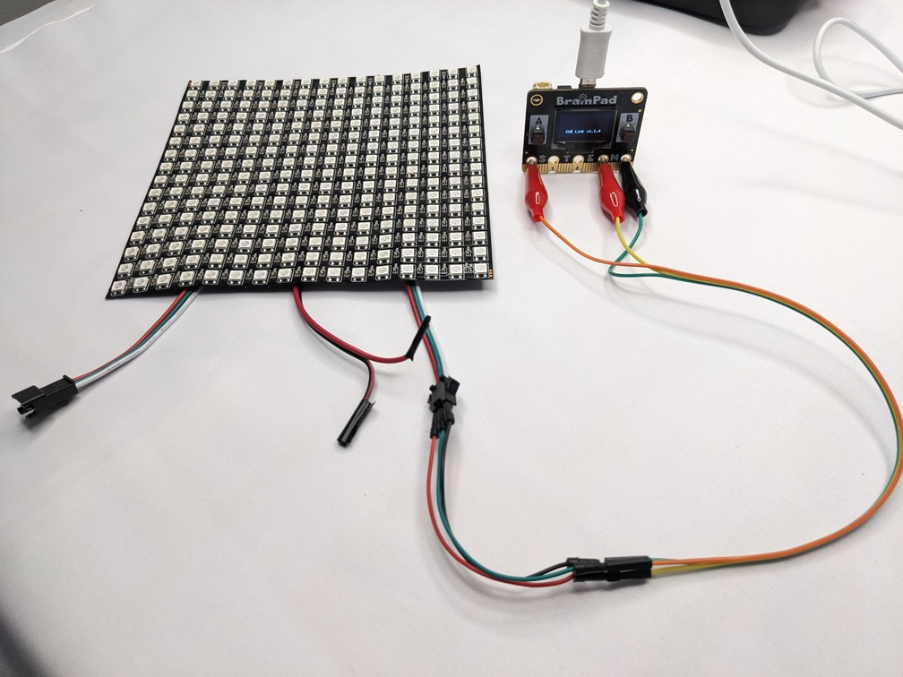
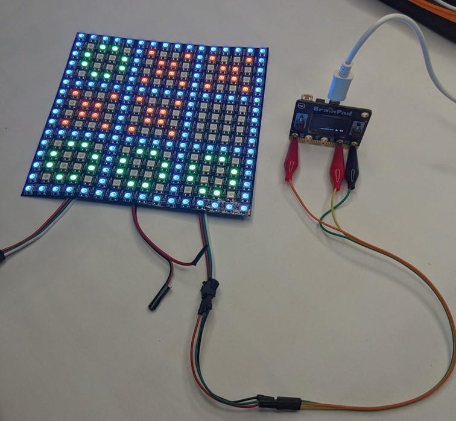

# Smart Tic Tac Toe on LED Matrix NeoPixels

This repository contains the code and resources for a smart Tic Tac Toe game implemented on an LED matrix using NeoPixels, programmed with Python on the BrainPad Pulse microcomputer. The game incorporates the MinMax algorithm to create an unbeatable bot opponent, providing a challenging gaming experience.

**Features**
- Play Tic Tac Toe on an 16*16 LED matrix display.
- Utilizes NeoPixels methods for visually engaging gameplay.
- Implements the MiniMax algorithm for smart decision-making by the bot opponent.
- Developed using Python programming language and compatible with BrainPad Pulse microcomputer by DUELink python library.

**Hardware:**
- [BrainPad Pulse Microcomputer](https://www.brainpad.com/devices/pulse/)
- 16x16 LED Matrix 256 Pixels WS2812B Digital Flexible LED
- 3 alligator clip to dupont wire

**Instructions:**
1. install DUELink python library to easy controlling the microcomputer GPIO, PINs, NeoPixel `pip install DUELink`. The DUELink package will also install all required dependencies. The library is also available on the [downloads](https://duelink.com/software/downloads.html) page if needed.
2. Connect your BrainPad Pulse microcomputer to the LED matrix.

3. Run the code on your computer IDE and make sure the BrainPad microcomputer is connecting to your computer with any USB port by USB Micro cable.
4. Press on-board button A to play against the smart bot opponent.

**Contributing:**
Contributions to this project are welcome! Feel free to fork this repository, make improvements, and submit pull requests.

**Credits:**
This project was inspired by the desire to create an entertaining and challenging game using NeoPixels and the BrainPad Pulse microcomputer. Special thanks to the developers of the [GHI Electronics](https://www.ghielectronics.com/) and [BrainPad](https://www.brainpad.com/) for providing the amazing user-friendly educational microcomputers.
